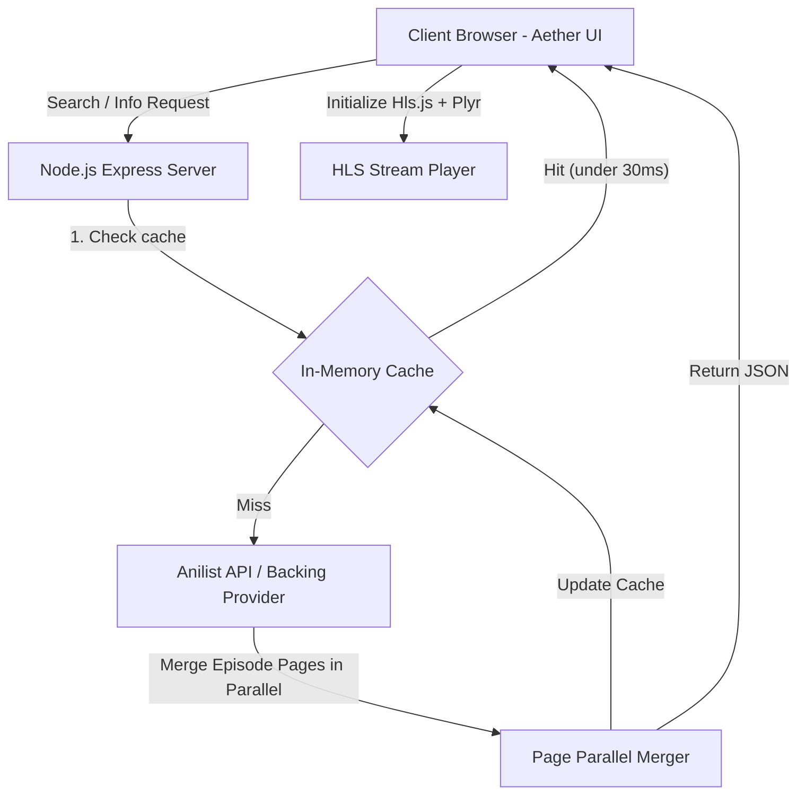

# 🌌 AETHER — Premium Anime Streaming Platform

Aether is a high-performance, premium single-page web application (SPA) for streaming anime. Built with a Node.js/Express backend and a modern vanilla frontend, it aggregates high-quality streams from multiple sources, resolves pagination constraints, and utilizes server-side caching to deliver sub-30ms load times.

---

## 🚀 Key Features

*   **⚡ Sub-30ms Details Loading:** Integrates an in-memory server cache with a 2-hour TTL, serving previously loaded details instantly.
*   **🔄 Parallel Episode Merging:** Programmatically resolves the standard 120-episode pagination limit on backing providers by fetching and merging all pages in parallel.
*   **🎭 Dual-Provider Seamless Switching:** Switch on the fly between **AnimeUnity** and **AnimeSaturn** directly from the navigation bar.
*   **📱 Premium Responsive UI:** Features Outfit & Inter typography, dark-mode styling, hover micro-animations, loading skeleton screens, and clean Crunchyroll-style episode tab pagination.
*   **📺 Native Player Integration:** Leverages **Plyr** and **Hls.js** to stream raw HTTP Live Streaming (HLS) `.m3u8` manifests with full player control.

---

## 🛠️ Architecture Flowchart



---

## 💻 Technology Stack

| Layer | Technology | Purpose |
|---|---|---|
| **Backend** | Node.js / Express | API router and static file hosting server |
| **Scraping Core** | `@consumet/extensions` | Backing engine for fetching anime metadata and stream sources |
| **Frontend** | HTML5 / JavaScript (ES6) | Responsive Single Page Application (SPA) client |
| **Styling** | CSS3 (Custom Grid/Variables) | Modern dark-mode layout and animations |
| **Player** | Plyr & Hls.js | HTML5 video player and HLS playlist handler |

---

## 📦 Installation & Setup

### Prerequisites
*   Node.js v16+
*   npm

### 1. Clone & Install Dependencies
```bash
git clone https://github.com/AmitHaina/anime-streaming.git
cd anime-streaming
npm install
```

### 2. Run the Server
```bash
npm start
```
The server will start on port `6969`. Open your browser and navigate to:
👉 **[http://localhost:6969](http://localhost:6969)**

---

## 📡 API Reference

### 1. Search Anime
```http
GET /api/search?q=<query>&provider=<unity|saturn>&page=<page_number>
```

### 2. Anime Details
```http
GET /api/info/:id?provider=<unity|saturn>
```
*Serves details. Automatically triggers parallel pagination merging if provider is `unity`.*

### 3. Stream Sources
```http
GET /api/sources?episodeId=<episode_id>&provider=<unity|saturn>
```

---

## 🔧 Troubleshooting

*   **Port Conflicts:** By default, the server runs on port `6969`. You can change this by setting the `PORT` environment variable:
    ```bash
    $env:PORT=8080; npm start
    ```
*   **Network Timeouts:** If the backing providers experience high latency, the cache miss response times may increase. Once cached, subsequent requests will load instantly.
